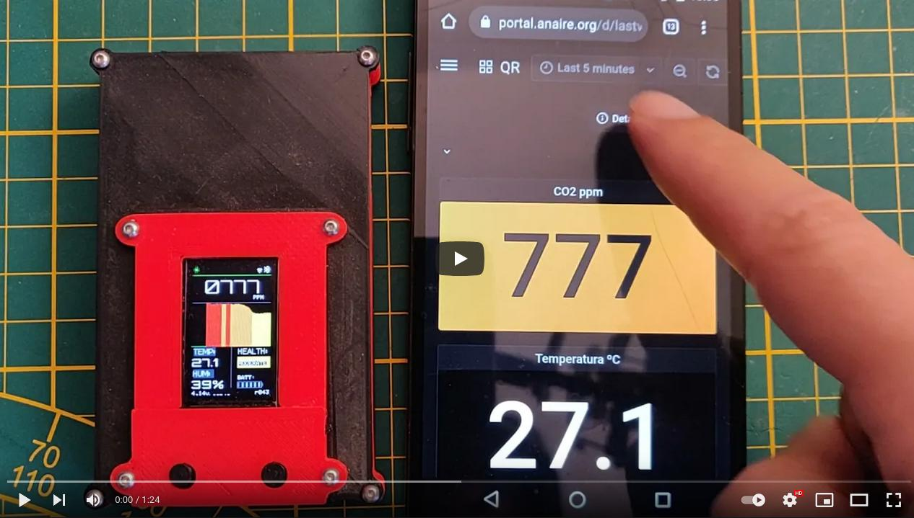

[](https://github.com/kike-canaries/android-hpma115s0/actions)  [](https://liberapay.com/CanAirIO) [](https://t.me/canairio) 

[](https://canair.io/docs/)

# CanAirIO Air quality Reporter

[CanAirIO](https://canair.io) is a citizen science initiative for air quality tracking, visualization and dissemination by using PM2.5 particulate material sensors paired with your smartphone via bluetooth.

This code is for [CanAir.io](https://canair.io) Android app that using a [DIY device](https://github.com/kike-canaries/canairio_firmware#canairio-firmware) that handle a pollution sensor (Honeywell, Sensirion, Plantower, Panasonic) or others air quality sensors.

# Installation

<a href="https://play.google.com/store/apps/details?id=hpsaturn.pollutionreporter" target="_blank"></a>

You can install it from the [release section](https://github.com/kike-canaries/esp32-hpma115s0/releases) downloading the last signed apk or installing from [GooglePlay](https://play.google.com/store/apps/details?id=hpsaturn.pollutionreporter)  


# CanAirIO Device

For test and use the CanAirIO app, is recommended have a CanAirIO device, you can have one with any ESP32 board without any sensor or any wire solder if you want, because CanAirIO has out of the box PAX Counter detector feature, for counts the people around you. For that you only need load our firmware via a easy web tool:

[](https://canair.io/installer.html)

# Usage

For now you need any Android device with Bluetooth 4 or above. You can download the CanAirIO app from [GooglePlay](https://play.google.com/store/apps/details?id=hpsaturn.pollutionreporter), keep in mind that it is in continuos development then please any feedback, report errors, or any thing please let us knowed it via our [contact form](http://canair.io/#three) or on our [Telegram chat](https://t.me/canairio)

You have **two configuration options or modes** of your CanAirIO device from the app:

## Mobile Station Mode

For record tracks on your device (Sdcard) or publish it to the cloud (share), please follow the next steps:

### Connection to device

<a href="https://github.com/kike-canaries/esp32-hpma115s0/blob/master/images/device_connection.jpg" target="_blank"></a>

### Recording track and share

<a href="https://github.com/kike-canaries/esp32-hpma115s0/blob/master/images/app_track_record.jpg" target="_blank"></a>

**NOTE**: Also all recorded tracks will be saved in the `/sdcard/canairio/` directory on `json` format.

### CanAirIO Mobile Map

We are developing a new mobile map, you can see the current tracks that the people share here:  

<a href="https://mobile.canair.io" target="_blank"></a>

---

## Fixed Station Mode

<a href="https://user-images.githubusercontent.com/423856/127383369-e57628a8-2a0b-44de-a29a-b8343a62f731.jpg" target="_blank"></a>

<a href="https://user-images.githubusercontent.com/423856/141691438-214808d5-d367-4a75-ad49-a1e7978b4269.gif" target="_blank"></a>

Also, you can connect your CanAirIO device to the WiFi and leave this like a fixed station. In this mode you only need the Android app only for setup the initial settings, after that the device could be publish data without the phone using the WiFi. For this please download the [CanAirIO app](https://bit.ly/3HjDJqP) and setup the WiFi:

### WiFi Setup

  - Open the app and enter on settings section
  - Choose the **Wifi Name** and set the **Password** (if it has) 
  - Save the credentials with the switch.
  - Wait for `connected` status in the summary switch  

<a href="https://user-images.githubusercontent.com/423856/141445500-ab6d7c6e-4a19-43fc-967e-c33ae60a073d.gif" target="_blank"></a>

### Publication

After WiFi is ready, please follow the next steps for publish your fixed station:

  - save Geohash location (turn on the switch for save, it will go to off after some seconds)
  - enable the publication switch
  - wait for some minutes, the device should be show data icon some times
  - your station should be in our [Global Map](canair.io/stations) with the special ID showed in the last item of settings 

### CanAirIO fixed station (fast setup guide)

[](https://youtu.be/29wfMPZXvps) 

# CanAirIO Documentation

We have a [documentation portal](https://canair.io/docs/app_usage.html#overview) with full information about the device and the app usage.

[](https://canair.io/docs/app_usage.html#overview)
 
# Supporting the project

If you want to contribute to the code or documentation, consider posting a bug report, feature request or a pull request.

When creating a pull request, we recommend that you do the following:

- Clone the repository
- Create a new branch for your fix or feature. For example, git checkout -b fix/my-fix or git checkout -b feat/my-feature.
- [Build and test your apk](#building-from-source-code), and run to any clang formatter if it is a code, for example using the `vscode` formatter. We are using Google style. More info [here](https://clang.llvm.org/docs/ClangFormatStyleOptions.html)
- Document the PR description or code will be great
- Target your pull request to be merged with `devel` branch

Also you can consider make a donation, be a patron or buy a device:  

<a href="https://raw.githubusercontent.com/kike-canaries/canairio_firmware/master/images/ethereum_donation_address.png" target="_blank"></a>

- Via **Ethereum**:
- 0x1779cD3b85b6D8Cf1A5886B2CF5C53a0E072C108
- Be a patron: [Github Sponsors](https://github.com/sponsors/hpsaturn), [LiberaPay](https://liberapay.com/CanAirIO)
- **Buy a device**: [CanAirIO Bike in Tindie](https://www.tindie.com/products/hpsaturn/canairio-bike/)
- Inviting us **a coffee**: [buymeacoffee](https://www.buymeacoffee.com/hpsaturn), [Sponsors](https://github.com/sponsors/hpsaturn?frequency=one-time) 

**NOTE:**  Supporting our Citizen Science Initiative many people be able to fight for air quality rights in many countries with this kind of problems. More info in [CanAir.IO](https://canair.io)

For our supporters, patrons or donors, we will send the files for our coming version:

## CanAirIO CO2 and CanAirIO Mini box


## TODO

- [X] BLE scanning and connecting 
- [X] Receive data via BLE notification
- [X] Basic chart for PM 2.5 data
- [X] BLE persist connection on background service
- [X] List recorded tracks fragment
- [X] Firebase connection for publish reports
- [X] Open Street map fragment
- [x] Export data to json on external storage (SD)
- [x] Osmdroid routes (for line or dinamic points)
- [ ] Add other air quality APIs to map (AQICN ie)
- [ ] Flutter migration for have to iOS app
- [ ] Osmdroid clusters (for static points)


# Building from source code

## Dependencies

- Android SDK
- CMake
- Android Studio (optional)

## Requirements

Please first clone the project with all submodules:

```bash
git clone --recursive https://github.com/kike-canaries/canairio_android.git
```

### Firebase

This application uses a Firebase Database instance to store mobile air quality reports, 

For local development, you will need to create a database in the [Firebase Console](https://console.firebase.google.com/) using `hpsaturn.pollutionreporter` as the application identifier and retrieve a `google-services.json` file. See instructions [here](https://support.google.com/firebase/answer/7015592?hl=en).

After that copy this file into the project:

```bash
cd canairio_android && cp ~/google-services.json app/
```

### AQICN API key (optional)

Please put your Aqicn API key in `app/src/main/res/values/api_aqicn.xml` or create a fake file like with:

``` xml
<resources>
    <string name="api_aqicn_key">7cbbbb864b9c0755b8xxxxyyy</string>
</resources>
```

## Compiling

```bash
./gradlew assembleDebug
```

## App apk installation 

```bash
./gradlew installDebug
```

# Credits

<div>Icons made by <a href="https://www.flaticon.com/authors/prosymbols" title="Prosymbols">Prosymbols</a> from <a href="https://www.flaticon.com/" title="Flaticon">www.flaticon.com</a> is licensed by <a href="http://creativecommons.org/licenses/by/3.0/" title="Creative Commons BY 3.0" target="_blank">CC 3.0 BY</a></div>
